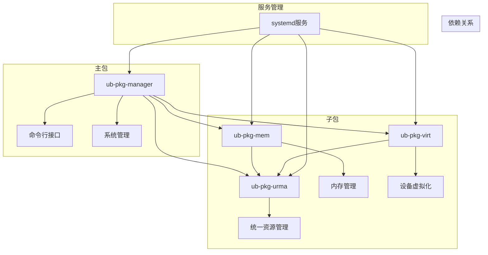

# ub-pkg-manager 项目设计文档

## 1. 项目概述

ub-pkg-manager 是一套用于管理、部署和监控 UB OS 软件包的工具集，包含多个功能模块和一个统一的命令行界面。本工具集旨在简化开发者和用户在软件包管理过程中的各项操作，提高工作效率。

### 1.1 主要功能

- ub os组件开机自动部署
- ub os组件配置
- ub基础能力检测

## 2. 系统架构

### 2.1 整体架构

ub-pkg-manager 采用分层架构设计，包含以下层次：

1. **命令行接口层**：提供统一的命令行界面，处理用户输入和命令执行
2. **核心功能层**：实现具体的功能模块，如软件包管理、资源管理等
3. **服务层**：通过 systemd 服务管理，实现系统级集成
4. **配置层**：通过 YAML 配置文件，提供用户自定义配置能力

### 2.2 组件关系



## 3. 模块设计

### 3.1 命令行模块

具体命令位于 `src/ub_manage/cli/commands/` 目录，实现了各种具体的功能命令。

- **update**：更新内核模块配置
- **check**：检查ub系统状态
- **load**：加载特定场景内核模块配置
- **dump**：导出配置
- **rollback**：回滚内核模块配置
- **list**：列出支持的内核模块或内核模块配置项

### 3.2 配置模块

配置模块位于 `src/ub_manage/etc/` 目录，提供系统配置的管理功能。

- **check.yml**：定义ub基础能力检测的配置
- **ko.yml**：定义内核模块的配置信息，便于内核模块的配置有效性检查

### 3.3 服务模块

服务模块通过 systemd 服务配置文件实现，位于项目根目录。

- **ub-pkg-manager.service**：ub-pkg-manager服务配置
- **ub-pkg-urma.service**：统一资源管理服务配置
- **ub-pkg-mem.service**：内存管理服务配置
- **ub-pkg-virt.service**：设备虚拟化服务配置

### 3.4 脚本模块

脚本模块位于 `src/ub_manage/scripts/` 目录，提供服务启动和管理的脚本。

- **ub-pkg-common.sh**：通用脚本函数和配置
- **00-ub-pkg-manager.sh**：主服务启动脚本
- **01-ub-pkg-urma.sh**：统一资源管理服务启动脚本
- **02-ub-pkg-mem.sh**：内存管理服务启动脚本
- **03-ub-pkg-virt.sh**：设备虚拟化服务启动脚本

## 4. 接口说明

### 4.1 命令行接口

#### 4.1.1 基本语法

```bash
ub-pkg-cli [command] [subcommand] [options]
```

#### 4.1.2 内置命令

- **help**：显示帮助信息
- **version**：显示版本信息

#### 4.1.3 核心命令

- **update**：更新内核模块配置

  ```shell
  # 更新指定内核模块
  ub-pkg-cli update <module>
  
  # 列出可用的内核模块参数
  ub-pkg-cli update <module> --list
  
  # 保存内核模块配置
  ub-pkg-cli update <module> --save <file>
  
  # 自动确认操作
  ub-pkg-cli update <module> --yes
  ```

- **check**：检查ub系统状态

  ```shell
  # 执行系统检查
  ub-pkg-cli check --action conf func

  # 以客户端的方式执行测试套件
  ub-pkg-cli check --action conf func --client
  ub-pkg-cli check -c
  ```

- **load**：加载特定场景内核模块配置

  ```shell
  ub-pkg-cli load ub --file /home/scenes.yml
  ```

  > **其中指定的 --file 参数的配置文件格式如下**：
  >
  > ```yaml
  > scene: ub
  > modules:
  >   - ko: obmm
  >     cmd: modprobe obmm
  >     args:
  >       - name: mempool_size
  >         value: 1G
  >       - name: mempool_refill_timeout
  >         value: 30000
  > ```

- **dump**：导出文件`/etc/modprobe.d/ub-pkg-manager.conf`设置的所有配置项

  ```shell
  ub-pkg-cli dump --file /home/ub-options.yml
  ```

- **rollback**：回滚特定内核模块的最近一次配置（**只支持单次回滚**）

  ```shell
  ub-pkg-cli rollback obmm
  ```

- **list**：列出支持的内核模块或内核模块配置项

  ```shell
  # 列出支持的所有场景
  ub-pkg-cli list --all
  
  # 列出ub场景下的所有ko配置
  ub-pkg-cli list --scene ub
  
  # 列出ub场景下的obmm的配置项
  ub-pkg-cli list --scene ub --module obmm
  
  # 列出ub场景下的obmm的配置项,包含场景名称的详细信息时
  ub-pkg-cli list --scene ub --module obmm -i
  ```

### 4.2 配置接口

通过修改 YAML 配置文件，可以实现系统配置的自定义。

- **主要配置文件**：`/etc/ub-pkg-manager/check.yml`

> ub基础能力检测模块的配置项，包括需要检查的第三方服务和需要执行的测试套

```yaml
external_service:
  - lcne
  - mami
test_kit:
  - name: urma_perftest
    client: true
    enable: true
    cmd: urma_perftest send_lat -d udma2 -s 2 -n 10 -p 0 --tp_aware --eid_idx 7 -l 128 -S 192.168.100.100
    result: bytes\s+iterations\s+t_min\[us\]\s+t_max\[ux\]
```

- **内核模块配置**：`/etc/modprobe.d/ub-pkg-manager.conf`

```ini
options obmm mempool_size=1G mempool_refill_timeout=30000 mempool_allocator=hugetlb_pud mem_allocator_granu=2m skip_cache_maintain=FALSE
```

## 5. 依赖管理

### 5.1 Python 依赖

| 依赖项 | 版本要求 | 用途 |
|--------|----------|------|
| pyyaml | >=6.0 | 处理 YAML 配置文件 |
| pydantic | - | 数据验证和设置管理 |
| rich | - | 命令行界面美化 |

### 5.2 系统依赖

| 依赖项 | 用途 |
|--------|------|
| systemd | 服务管理 |
| python3 >= 3.6 | 运行环境 |

### 5.3 组件间依赖

| 组件 | 依赖项 | 用途 |
|------|--------|------|
| ub-pkg-manager | ub-pkg-urma, ub-pkg-mem, ub-pkg-virt | 核心功能依赖 |
| ub-pkg-urma | ubctl, ubutils, libummu, libcdma, umdk-urma-lib, umdk-urma-bin, umdk-urpc-umq, umdk-urma-tools, umdk-dlock-lib, umdk-urpc-framework, umdk-urpc-framework-tools, umdk-urpc-umq-devel, umdk-urpc-umq-tools | 统一资源管理 |
| ub-pkg-mem | ub-pkg-urma, sysSentry, libobmm | 内存管理 |
| ub-pkg-virt | ub-pkg-urma, qemu, libvirt, memlinkd | 设备虚拟化 |

## 6. 部署流程

### 6.1 安装步骤

#### 6.1.1 通过dnf包管理器安装

```bash
# 安装 ub-pkg-manager 包
dnf install -y ub-pkg-manager

# 安装 ub-pkg-mem 包
dnf install -y ub-pkg-mem

# 安装 ub-pkg-virt 包
dnf install -y ub-pkg-virt

# 安装 ub-pkg-urma 包
dnf install -y ub-pkg-urma
```

#### 6.1.2 通过rpmbuild构建安装

```bash
# 1. 安装构建依赖
dnf install rpmdevtools*

# 2. 创建构建目录
rpmdev-setuptree

# 3. 克隆源代码
git clone https://atomgit.com/openeuler/ub-pkg-manager
cd ub-pkg-manager

# 4. 准备源码包
tar -czf ~/rpmbuild/SOURCES/ub-pkg-manager-0.0.3.tar.gz .

# 5. 复制spec文件
cp ub-pkg-manager.spec ~/rpmbuild/SPECS/

# 6. 构建RPM包
rpmbuild -ba ~/rpmbuild/SPECS/ub-pkg-manager.spec

# 7. 安装构建好的RPM包
rpm -ivh ~/rpmbuild/RPMS/aarch64/ub-pkg-mem-*.rpm
rpm -ivh ~/rpmbuild/RPMS/aarch64/ub-pkg-virt-*.rpm
rpm -ivh ~/rpmbuild/RPMS/aarch64/ub-pkg-urma-*.rpm
```

### 6.2 服务启动配置

#### 6.2.1 ub-pkg-mem 服务

```bash
# 启动服务
systemctl start ub-pkg-mem

# 查看服务状态
systemctl status ub-pkg-mem
```

#### 6.2.2 ub-pkg-virt 服务

```bash
# 启动服务
systemctl start ub-pkg-virt

# 查看服务状态
systemctl status ub-pkg-virt
```

#### 6.2.3 ub-pkg-urma 服务

```bash
# 启动服务
systemctl start ub-pkg-urma

# 查看服务状态
systemctl status ub-pkg-urma
```

#### 6.2.4ub-pkg-cli命令行

```bash
ub-pkg-cli --version
```

### 6.3 配置文件位置

- 主要配置文件：`/etc/ub-pkg-manager/check.yml`
- 内核模块配置：`/etc/modprobe.d/ub-pkg-manager.conf`

